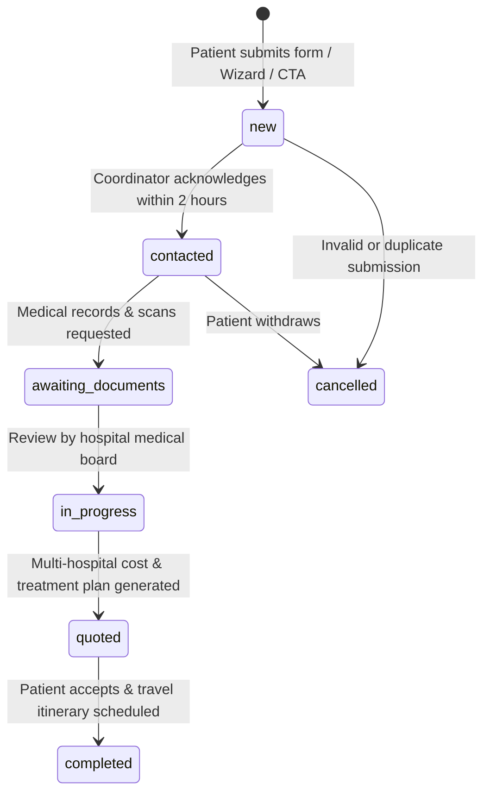

# Med360 — Master Business Logic & Production Operations Runbook

**Version**: 2.6.0  
**Target Environment**: Production / Staging / Local Dev  
**Author**: Med360 Technical Architecture Team  
**Classification**: Master System & Business Operations Specification

---

## 1. Executive Summary & NGO Business Model

### 1.1 Social Enterprise Mission
Med360 is a specialized medical travel and healthcare concierge platform wholly owned by the registered NGO **Enn Rêv Enn Sourir** (Mauritius).

For over a decade, Enn Rêv Enn Sourir has funded and coordinated life-saving specialized medical treatment abroad for underprivileged patients. Med360 operates as a **social enterprise**:
- It extends world-class healthcare concierge services (second opinions, treatment coordination, travel logistics, and VIP hospital admissions across 15 premier Indian accredited hospitals) to private patients and corporate clients.
- **100% of net profits generated by Med360 are reinvested directly into the NGO's medical assistance fund** to subsidize urgent surgeries and overseas treatments for underprivileged Mauritian patients.

```
┌─────────────────────────────────────────────────────────────────────────────┐
│                       MED360 REVENUE REINVESTMENT CYCLE                     │
├─────────────────────────────────────────────────────────────────────────────┤
│                                                                             │
│  [ Paying Patients & Corporate Clients ]                                     │
│                     │                                                       │
│                     ▼                                                       │
│  [ Med360 Healthcare Concierge Services ] ──( Operational Costs )           │
│                     │                                                       │
│                     ▼ (100% Net Profit)                                     │
│  [ NGO Enn Rêv Enn Sourir Medical Assistance Fund ]                         │
│                     │                                                       │
│                     ▼                                                       │
│  [ Free Specialized Care for Needy Patients in Mauritius & Abroad ]         │
│                                                                             │
│                                                                             │
└─────────────────────────────────────────────────────────────────────────────┘
```

---

## 2. Core Clinical & Domain Business Logic

### 2.1 Multi-Currency Cost Calculator Engine
The platform includes an interactive cost calculator comparing Western medical costs (US/Europe/UK) against premier accredited partner hospitals in India.

- **Savings Calculation**:
  $$\text{Savings USD} = \text{Western Cost USD} - \text{Destination Cost USD}$$
  $$\text{Savings Percentage} = \text{round}\left(\frac{\text{Savings USD}}{\text{Western Cost USD}} \times 100\right)$$
- **Currency Conversion**:
  $$\text{Amount MUR} = \text{round}(\text{Amount USD} \times \text{Exchange Rate})$$
  *(Default base rate: $1\text{ USD} = 46.5\text{ MUR}$)*
- **Procedure Pricing Benchmarks**:
  - *Cardiac Surgery (CABG / Valve)*: US $\$120,000$ vs. India $\$6,500$ (95% savings $\approx 302,250\text{ MUR}$).
  - *Orthopedics (Total Knee/Hip Replacement)*: US $\$45,000$ vs. India $\$5,200$ (88% savings $\approx 241,800\text{ MUR}$).
  - *Oncology (Proton Beam / CyberKnife)*: US $\$95,000$ vs. India $\$12,000$ (87% savings $\approx 558,000\text{ MUR}$).
  - *Robotic Urology / Prostatectomy*: US $\$40,000$ vs. India $\$6,000$ (85% savings $\approx 279,000\text{ MUR}$).
  - *IVF / Fertility*: US $\$18,000$ vs. India $\$3,500$ (81% savings $\approx 162,750\text{ MUR}$).

---

### 2.2 Clinical Inquiry & Triage Lifecycle
Patient inquiries undergo a strict clinical case-management lifecycle:



#### Triage Urgency Classifications:
1. **Routine**: Elective orthopedic, cosmetic, fertility, or non-acute surgeries. SLA: 24-hour turnaround.
2. **Urgent**: Active oncology diagnosis, progressive cardiovascular symptoms, organ transplant evaluation. SLA: 4-hour turnaround.
3. **Emergency**: Acute coronary syndrome, critical surgical indications requiring urgent coordination. Immediate 24/7 hotline dispatch.

---

### 2.3 Email Attribution & Notification Dispatch
All inquiry forms (Intake Wizard, Contact Page, Header/Footer CTAs, Inside Page CTAs) capture:
- **Sender Identity**: Full Name, Email, Phone/WhatsApp, Country of Residence.
- **Clinical & Preference Context**: Requested Specialty, Service, Target Hospital, Urgency, Budget Range, Clinical Description.
- **Traffic Origin**: Source Page and Referrer URL.
- **Actionable Notifications**: Sent via Resend to `kevinadlib@gmail.com` (Test recipient) or `VITE_ADMIN_EMAIL`, containing 1-click response buttons (WhatsApp with pre-filled message, direct email reply, phone dial, Admin Portal lead link).

---

### 2.4 WhatsApp 24/7 Lead Sync & Webhook Architecture
- **Mauritius Hotline**: `+230 5918 8275` (Accessible globally via `https://wa.me/23059188275`).
- **Context-Aware Dynamic URIs**: Outbound click-to-chat links automatically pre-populate the patient's selected specialty, target doctor, and hospital preference.
- **Outbound Telemetry Tracking**: All clicks to WhatsApp are recorded with timestamps, referrer page, and lead intent.
- **Serverless Edge Webhook Receiver** (`api/webhooks/whatsapp.ts`):
  - **`GET`**: Handles Meta Graph API challenge handshake (`hub.mode === 'subscribe'`, `hub.verify_token === WHATSAPP_VERIFY_TOKEN`).
  - **`POST`**: Ingests incoming WhatsApp messages, returning `200 OK` within $<200\text{ms}$.

---

### 2.5 Catalog Matrix (15 Hospitals & 15 Specialties)
- **15 Indian Partner Hospitals**: Apollo Hospitals (Chennai & Navi Mumbai), Manipal Hospital (Bengaluru), Fortis (Gurugram & Mulund), MGM Healthcare (Chennai), MIOT International (Chennai), Artemis (Gurugram), BLK-Max (New Delhi), Gleneagles HealthCity (Chennai), Dr. Rela Institute (Chennai), Amrita (Kochi & Faridabad), SIMS Hospital (Chennai), Yashoda (Hyderabad), Marengo Asia (Gurugram), Kauvery Hospital (Chennai), Max Super Speciality (Saket, New Delhi).
- **15 Specialties**: Oncology, Cardiology, Orthopedics, Organ Transplant, Neurosurgery, Robotic Surgery, IVF, Urology, Gastroenterology, Pediatric Surgery, Bariatrics, Ophthalmology, ENT, Pulmonology, Plastic Surgery.

---

## 3. Multilingual & Localization (i18n) Engine

The platform supports 3 primary languages with automated fallback:
- **French (`fr`)**: Regional Francophone default (Mauritius, Réunion, Madagascar, West Africa).
- **Mauritian Creole (`kr`)**: Local vernacular accessibility.
- **English (`en`)**: International patient default.

### Localization Rules:
- Dynamic entity attributes use localized field keys (`name_fr`, `name_kr`, `description_fr`, etc.).
- If a localized string is undefined, the engine gracefully falls back to French or English baseline.
- The language switcher updates `i18n.language` and persists user preference across sessions.

---

## 4. UI/UX Architecture Guidelines (Strict Rules)

### 4.1 Strict Zero-Modal / Zero-Popup Rule
- **No Dialog Modals for CRUD**: Creating, editing, or deleting items (hospitals, doctors, specialties, inquiries, case studies, procedures) must **never** open a blocking modal dialog overlay.
- **Inline Workstations Only**: All creation and modification workflows use **inline expandable forms**, **in-place editor cards**, or **accordion panels** embedded directly in the page flow.
- **Deletion Confirmations**: Handled via inline confirmation bars directly within the active card rather than native `alert()` or modal popups.

### 4.2 File Size Limit Cap
- Every source code file (`.ts` and `.tsx` in `src/`) must strictly remain $\le 750$ lines of code to maintain clean separation of concerns.

---

## 5. Request Minimization & Performance Caching Architecture

To achieve an **80%–95% reduction in backend requests**, Med360 employs a 5-layer optimization stack:

```
┌─────────────────────────────────────────────────────────────────────────────┐
│                     5-LAYER REQUEST ELIMINATION ENGINE                      │
├─────────────────────────────────────────────────────────────────────────────┤
│  1. Inflight Request Collapsing (SingleFlight)                              │
│     - Deduplicates concurrent identical requests into 1 network Promise.    │
│  2. L1 RAM Hot Cache                                                        │
│     - In-memory sub-millisecond instant hit (0ms latency).                  │
│  3. L2 Persistent Storage Cache                                             │
│     - LocalStorage cache with TTL surviving full browser reloads.           │
│  4. Client-Side Derived Projections                                         │
│     - getHospitalById / getFeatured derive locally from cached master lists.│
│  5. Mutation-Aware Tag Invalidation                                         │
│     - createHospital automatically invalidates 'hospitals' tag only.        │
└─────────────────────────────────────────────────────────────────────────────┘
```

---

## 6. Environment Variables & Secret Configuration

| Key | Type | Description | Default / Fallback |
| :--- | :--- | :--- | :--- |
| `VITE_SITE_URL` | URL | Canonical production URL | `https://www.med360.mu` |
| `VITE_SUPABASE_URL` | URL | Supabase cloud project URL | `https://xxxx.supabase.co` |
| `VITE_SUPABASE_ANON_KEY` | String | Supabase anonymous public API key | JWT token |
| `VITE_ADMIN_EMAIL` | String | Admin inbox for lead notifications | `kevinadlib@gmail.com` (Test) |
| `VITE_WHATSAPP_PHONE` | String | 24/7 WhatsApp consultation hotline | `23059188275` |
| `VITE_ADMIN_PASSWORD` | String | Master authentication password for `/admin` | Configurable |
| `RESEND_API_KEY` | String | Serverless Resend API key | Configured in Vercel |
| `WHATSAPP_VERIFY_TOKEN` | String | Verification token for Meta Webhooks | Configured in Vercel |

---

## 7. Development & Verification Workflows

### 7.1 Local Development
```bash
# Install dependencies
npm install

# Start local development server
npm run dev
# Running at http://localhost:5173
```

### 7.2 Automated Test & Verification Pipeline
```bash
# Run unit, math, security, zero-modal, and request-minimization tests (25 suites)
npm test

# Run full TypeScript compiler check (tsc --noEmit)
npx tsc --noEmit

# Run Vite production bundle build
npm run build
```

---

## 8. Operational Playbooks

### Playbook A: Database Schema Provisioning
1. Open the [Supabase SQL Editor](https://supabase.com/dashboard).
2. Execute [`supabase_schema.sql`](file:///d:/WEB%202026/Med360/medical360/supabase_schema.sql).
3. Tables provisioned: `hospitals`, `specialties`, `doctors`, `case_studies`, `inquiries`, `cms_pages`, `whatsapp_logs`.
4. RLS policies allow public read and authenticated/service writes.

### Playbook B: System Backup & Point-in-Time Recovery
- **Generate Backup**: Navigate to `/admin/settings` $\to$ **Backups & Recovery** $\to$ Click **"Generate Complete System Backup"**.
- **Restore**: Drag-and-drop a valid backup `.json` into the recovery dropzone.

### Playbook C: CMS Live Content & Marquee Ribbon Configuration
- **Static Pages**: Edit page copy at `/admin/pages` (Home, About, How It Works, Legal).
- **Mission Marquee Ribbon**: Configure announcement text, scrolling speed, and toggle positioning at `/admin/marquee`.

---

## 9. Pre-Flight Release Checklist

- [ ] `npm test` passes 100% (all automated test suites pass).
- [ ] `npx tsc --noEmit` passes with 0 TypeScript compiler errors.
- [ ] `npm run build` succeeds without bundling errors.
- [ ] Zero blocking modal popups exist in CRUD workflows (UX guidelines compliance).
- [ ] All `.ts` and `.tsx` source files in `src/` are strictly $\le 750$ lines of code.
- [ ] Security headers and CSP active in `index.html` and `vercel.json`.
- [ ] Multilingual strings complete across `en`, `fr`, `kr`.
- [ ] 44 XML Sitemap URLs resolve cleanly and robots.txt protects `/admin`.
